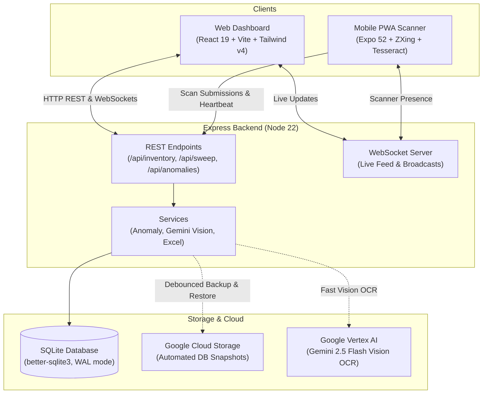

# shelv.ai

> **Intelligent Inventory Sweep, Reconciliation & Anomaly Detection Platform**

`shelv.ai` is a full-stack inventory auditing platform designed to streamline physical warehouse and storage sweeps. It enables teams to audit cataloged assets in real time using mobile camera barcode scanning and AI-powered optical character recognition (OCR), immediately flags misplaced or unauthorized items against an official baseline, and synchronizes discrepancies across web dashboards via WebSockets.

---

## Architecture Overview

The system is organized as a lightweight pnpm monorepo consisting of a React web dashboard, an Expo-powered mobile scanning progressive web app (PWA), an Express backend with an embedded SQLite database (persisted to Google Cloud Storage), and Google Vertex AI (Gemini 2.5 Flash) vision capabilities.



---

## Monorepo Layout

Each component is decoupled into its own workspace package:

| Directory | Role | Primary Tech Stack | Documentation |
| :--- | :--- | :--- | :--- |
| [`web/`](file:///c:/dev/shelv.ai/web) | Manager & Auditor Web Dashboard | React 19, Vite, Tailwind CSS v4, Lucide React, Axios | [Web README](file:///c:/dev/shelv.ai/web/README.md) |
| [`mobile/`](file:///c:/dev/shelv.ai/mobile) | Mobile Scanner Application (PWA / Native) | Expo 52, React Native Web, ZXing, Tesseract.js | [Mobile README](file:///c:/dev/shelv.ai/mobile/README.md) |
| [`server/`](file:///c:/dev/shelv.ai/server) | Backend API, Realtime Broadcasts, Database Engine | Express 4, TypeScript, `better-sqlite3`, `ws`, Vertex AI | [Server README](file:///c:/dev/shelv.ai/server/README.md) |
| [`scripts/`](file:///c:/dev/shelv.ai/scripts) | Cross-package versioning and git metadata tooling | Node.js CommonJS | [Scripts README](file:///c:/dev/shelv.ai/scripts/README.md) |
| [`.agents/`](file:///c:/dev/shelv.ai/.agents) | Autonomous agent skills & custom capabilities | Agent Skills Specification | [AGENTS.md](file:///c:/dev/shelv.ai/AGENTS.md) |

---

## Core Domain Concepts

Understanding the core entities is essential when navigating or modifying the system:

- **Inventory Holder (`inventory_holders`)**: An individual custodian responsible for a designated set of assets (identified by personal number, name, email, phone).
- **Room (`rooms`)**: A physical location or storage unit belonging to a specific inventory holder, identified by a unique code and human-readable name.
- **MASHA (`masha_registry`)**: Standard catalog / SKU numbering system (often formatted as grouped digits, e.g. `123-456-7890`) representing an equipment model or catalog entry.
- **Official Inventory (`official_inventory`)**: The ground-truth baseline of expected items, imported from organizational Excel spreadsheets, tying serial numbers and MASHA codes to designated rooms and holders.
- **Sweep Session (`sweep_sessions`) & Observations (`sweep_observations`)**: An active physical audit pass through a room. Scanners log observations containing barcode serial numbers, MASHA codes, OCR detections, and timestamps.
- **Anomalies**: Discrepancies computed automatically between the official baseline and live sweep observations:
  - **Unauthorized Transfers**: An item assigned to Holder A was physically scanned in Holder B's room.
  - **Internal Moves**: An item was moved between different rooms belonging to the *same* holder.
  - **Quota Discrepancies**: The actual observed count of a MASHA item differs from the expected count assigned to a holder.
  - **Missing Items**: Items present in the baseline that have not been observed in sweeps.
- **Action History (`action_history`)**: An audit log recording state modifications (edits, scans, resolutions) with built-in reversal (undo) support.

---

## Getting Started

### Prerequisites

- **Node.js**: `v22.x` or later
- **pnpm**: `v11.x` or `v12.x` (Corepack enabled)

```bash
corepack enable
corepack prepare pnpm@11.9.0 --activate
```

### Installation

Install dependencies across all packages using the root script:

```bash
pnpm install:all
```

*(Alternatively: `pnpm --dir server install && pnpm --dir web install && pnpm --dir mobile install`)*

### Development Servers

You can run individual services concurrently:

```bash
# Terminal 1: Backend API & WebSocket Server (default: port 4000)
pnpm dev:server

# Terminal 2: Web Dashboard (default: port 5173 with proxy to 4000)
pnpm dev:web

# Terminal 3: Mobile Scanner Web / Expo (default: port 8081)
pnpm dev:mobile
```

### Building for Production

```bash
# Build all workspaces (automatically increments patch version across all manifests)
pnpm build
# or: pnpm build:all

# Build all workspaces without bumping version
pnpm build:no-bump
```

- Increments semver patch version across all 5 manifests and updates `version.ts`
- Web dashboard outputs to `web/dist`
- Mobile PWA exports to `mobile/dist`
- Server compiles TypeScript to `server/dist`

---

## Deployment & Production Architecture

In production, the platform runs as a single unified container deployed on **Google Cloud Run** via Google Cloud Build ([`cloudbuild.yaml`](file:///c:/dev/shelv.ai/cloudbuild.yaml)):

1. **Multi-Stage Dockerfile** ([`Dockerfile`](file:///c:/dev/shelv.ai/Dockerfile)):
   - Stage 1 builds the Vite React dashboard (`web/dist`).
   - Stage 2 exports the Expo mobile PWA (`mobile/dist`).
   - Stage 3 compiles the Express server and prunes dev dependencies.
   - Stage 4 (Runner) hosts the Express server, mounts the web dashboard at `/`, mounts the mobile PWA at `/scanner`, and initializes SQLite.
2. **Cloud Storage Database Persistence**:
   - Because Cloud Run containers are stateless, the server automatically restores `shelv.db` from a Google Cloud Storage bucket (`GCS_BUCKET_NAME`) on startup.
   - Any state mutation (POST/PUT/DELETE) debounces an online SQLite checkpoint backup uploaded directly back to GCS without downtime.
3. **Cloud Run Cost Optimization**:
   - Configured with `min-instances=0` (scales to zero when idle for $0 cost) and 512MiB memory footprint.

---

## Versioning

Monorepo versions are strictly synchronized across all packages (`package.json`, `web/package.json`, `server/package.json`, `mobile/package.json`, `mobile/app.json`).

```bash
# Verify all workspace versions are identical
pnpm version:check

# Sync or bump versions
pnpm version:bump [patch | minor | major]
```

See the [Scripts Documentation](file:///c:/dev/shelv.ai/scripts/README.md) for further details.

---

## Guides & Documentation

- 🤖 **AI Agent Playbook**: [AGENTS.md](file:///c:/dev/shelv.ai/AGENTS.md) — Comprehensive technical reference, patterns, database rules, and conventions for coding agents.
- 🖥️ **Backend Guide**: [server/README.md](file:///c:/dev/shelv.ai/server/README.md) — API endpoints, WebSocket protocol, database schema, and background services.
- 🌐 **Web Dashboard Guide**: [web/README.md](file:///c:/dev/shelv.ai/web/README.md) — React 19 pages, UI components, context providers, and Tailwind design tokens.
- 📱 **Mobile Scanner Guide**: [mobile/README.md](file:///c:/dev/shelv.ai/mobile/README.md) — Expo camera, ZXing barcode decoding, Tesseract OCR, and offline sync.
- 🛠️ **Tooling Guide**: [scripts/README.md](file:///c:/dev/shelv.ai/scripts/README.md) — Version synchronizer and git metadata generators.
