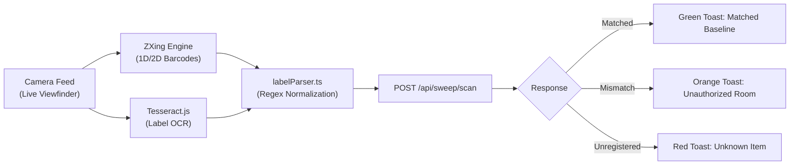

# shelv.ai Mobile Scanner (`mobile/`)

> **Expo 52 (React Native Web) Mobile Scanner & PWA for Physical Shelf Audits**

The `mobile` package contains the mobile scanner application designed for warehouse and storage room audits. It runs seamlessly as an installable Progressive Web App (PWA) in any modern mobile browser (Safari, Chrome) and can also be packaged as a native Android or iOS application via Expo.

---

## Tech Stack

- **Framework**: [Expo 52](https://expo.dev/) (React Native `0.76.9`)
- **Web Runtime**: [React Native Web `~0.19.13`](https://necolas.github.io/react-native-web/)
- **Barcode Engine**: [@zxing/browser](https://github.com/zxing-js/browser) & [@zxing/library](https://github.com/zxing-js/library) (Code 128, Code 39, QR Code, Data Matrix, EAN)
- **OCR Engine**: [Tesseract.js `^7.0.0`](https://tesseract.projectnaptha.com/) for client-side optical character recognition
- **Camera API**: `expo-camera ~16.0.0` and HTML5 MediaStreams
- **Package Manager**: pnpm

---

## Directory Structure

```
mobile/
├── public/                 # PWA icons and web manifest
│   ├── favicon.svg
│   └── manifest.json       # Web app manifest for Add-to-Homescreen support
├── src/
│   ├── components/
│   │   └── MobileVersionBadge.tsx # Version, commit, and branch info pill
│   ├── services/
│   │   ├── api.ts          # REST client for scan submissions & item lookup
│   │   ├── labelParser.ts  # Parsing logic for MASHA numbers and serials
│   │   └── scannerPresence.ts # Presence heartbeat & teardown beacon
│   └── version.ts          # Generated version and commit metadata
├── App.tsx                 # Main scanner application & UI
├── app.json                # Expo project configuration
├── package.json
└── tsconfig.json
```

---

## Core Scanning Pipeline



### 1. Viewfinder & Barcode Capture
- Uses `expo-camera` or HTML5 `getUserMedia` to stream video to a `<video>` or `<canvas>` element.
- The ZXing browser reader scans video frames in a continuous requestAnimationFrame loop for 1D barcodes (standard asset tags) and 2D QR codes.

### 2. Optical Character Recognition (OCR)
- When barcode tags are faded or damaged, OCR extracts text from label photos via `tesseract.js`.
- [`labelParser.ts`](file:///c:/dev/shelv.ai/mobile/src/services/labelParser.ts) sanitizes noisy OCR output to locate:
  - **MASHA number patterns** (numeric strings formatted as e.g. `###-###-####` or 10 digits).
  - **Serial numbers** (prefixed with `S/N`, `SN`, `מספר סידורי`, etc.).
  - **Product names and holder tags**.

### 3. Immediate Feedback & Auditing
- Scanned items are immediately transmitted to the backend (`POST /api/sweep/scan`).
- The response returns one of three states:
  - `matched`: Item is verified in the correct room.
  - `mismatch`: Item belongs to another room or custodian (generates an anomaly).
  - `unregistered`: Item does not exist on the official baseline.
- Scanners can immediately tap **Undo** to revert accidental scans via `DELETE /api/sweep/scans/:id`.

---

## Scanner Presence & Heartbeats (`src/services/scannerPresence.ts`)

- Upon selecting an audit room, the mobile client starts a background heartbeat pinging `POST /api/sweep/scanners/heartbeat` every 10 seconds.
- When the user closes or navigates away from the scanner, `navigator.sendBeacon` triggers `POST /api/sweep/scanners/disconnect`.
- This informs managers watching the **LiveFeed** on the web dashboard which rooms are actively being swept and by whom.

---

## Production PWA Export & Express Mounting

In production, the mobile scanner is compiled into a standalone static web application:

1. **Export**:
   ```bash
   pnpm run build:web
   ```
   This invokes `expo export --platform web`, copies `manifest.json` and favicon into `dist/`, and customizes the web title.
2. **Server Mounting**:
   The backend Express server checks if `mobile/dist` exists and mounts it:
   - Scanner UI: `http://<host>:<port>/scanner`
   - Static bundles: `http://<host>:<port>/_expo`

---

## Development Commands

```bash
# Launch mobile scanner in web mode (port 8081)
pnpm web

# Start Expo Metro bundler
pnpm start

# Run on connected Android device / emulator
pnpm android

# Run on iOS simulator
pnpm ios

# Build static PWA for production distribution (outputs to mobile/dist/)
pnpm build:web
```
